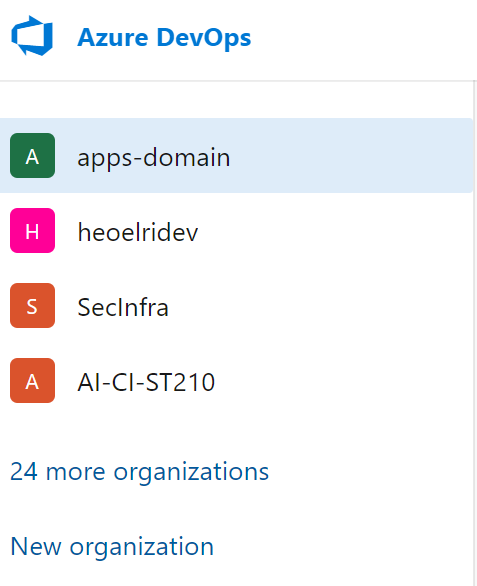
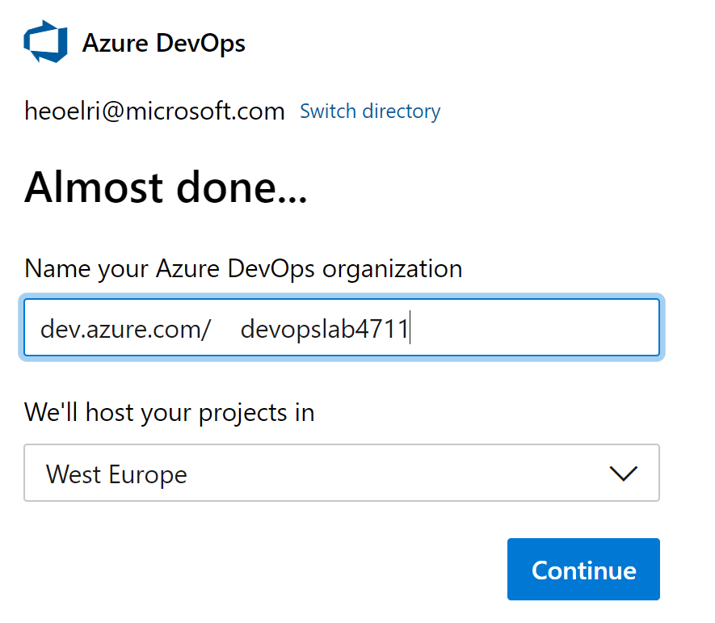
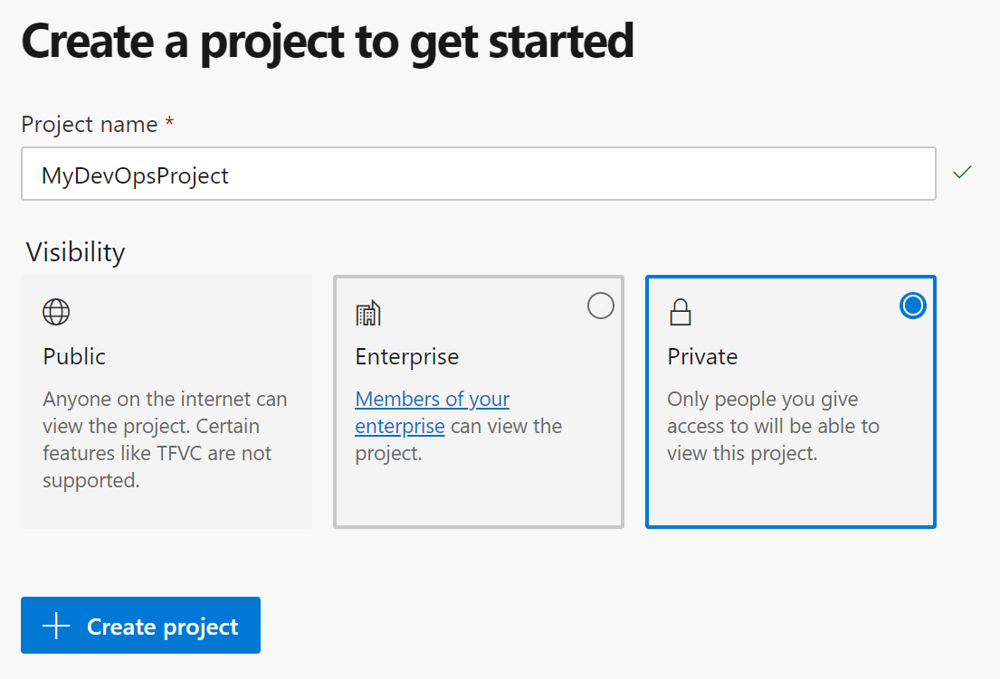
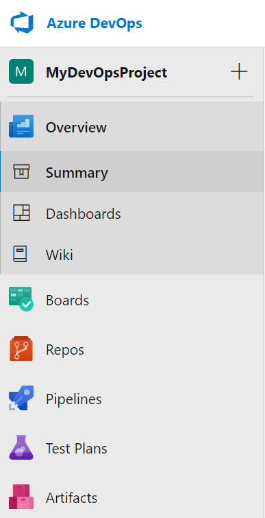

# What do i need?
* Azure DevOps
* Azure Subscription (AIRS, MSDN or others)
# Prepare your Azure DevOps (ADO) Organization
## Create a new ADO Organization
Goto [dev.azure.com](http://dev.azure.com) and signin with your credentials. If you don't already have a DevOps organization you can use for testing create a "New organization" by clicking on "New organization":

The next step is to define a name for your new ADO Organization:

And click on "Continue". Now we have a new Organization in Azure DevOps and we can continue with creating a new project.

## Create a new ADO Project

Within your new ADO organization you can create one or more so called "Projects". Projects can have different levels of visibility:
* Public - Anyone on the internet can view the project.
* Enterprise - Member of your enterprise can view the project.
* Private - Only people you give access to will bve able to view this project.

For our training we specify a name, select "Private" and click on "+ Create project".

After a few seconds you should see your new project in Azure DevOps:

We're now done with the preparation and can continue with [Lab 1](../lab1/lab1.md) (or go back to the [Overview](../../README.md)).