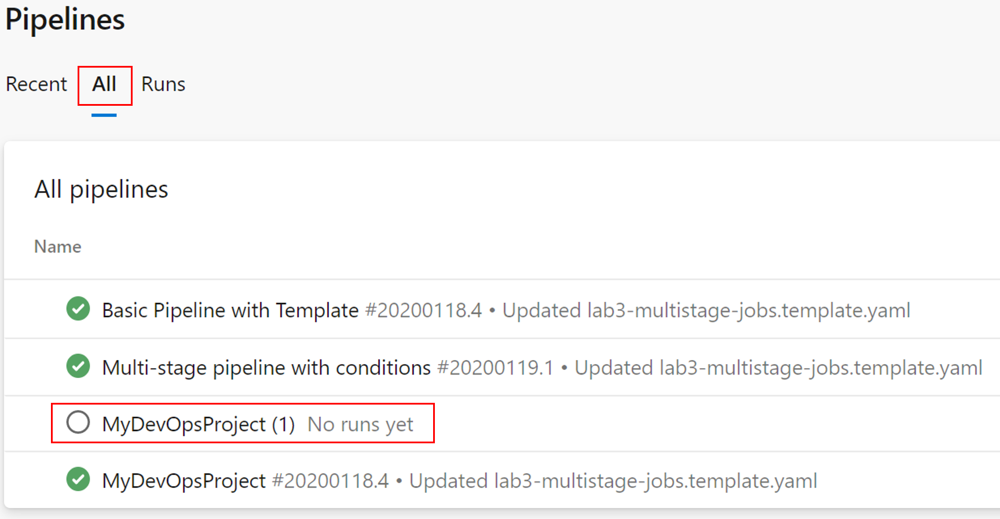
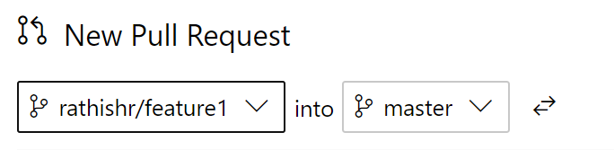
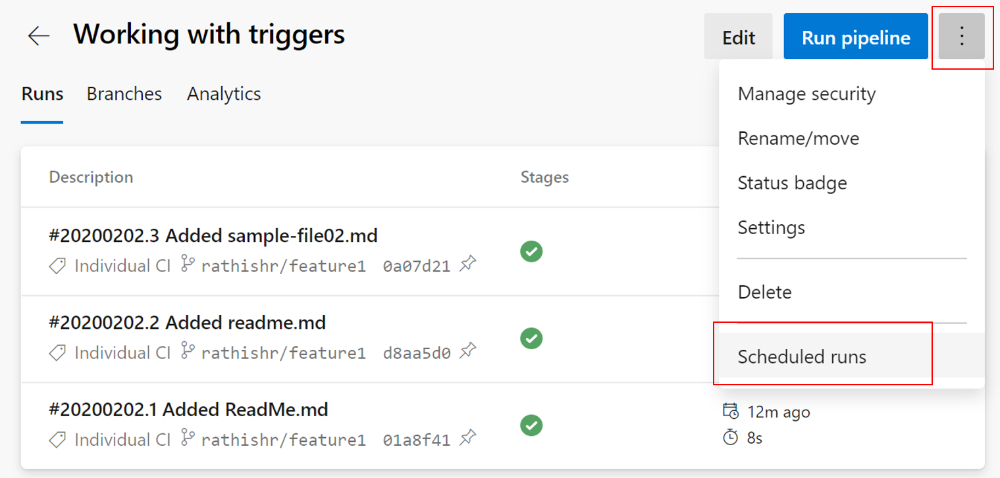
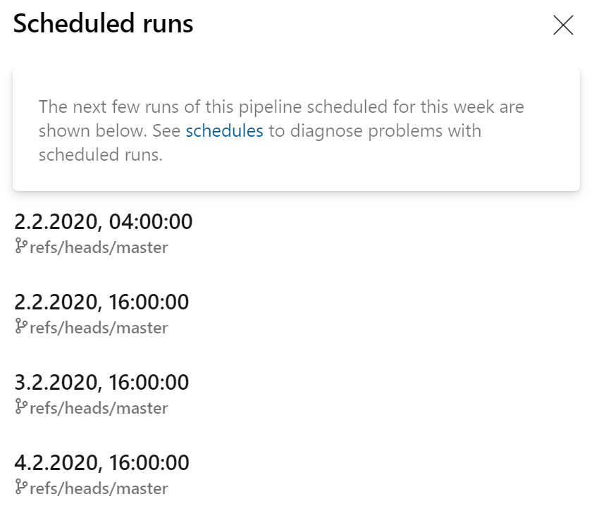

# Lab 4 - Triggers

Any DevOps lifecycle comprises of bunch of process that run at different stages of the lifecycle consuming and exposing data through various channels. Triggers enable customer to orchestrate the DevOps process in an efficient manner by automating the CI/CD process.

Triggers are events on which you can start your pipeline run automatically. You can enable triggers on your pipeline by subscribing to both internal and external events. An event can be completion of a process, availability of a resource, status update from a service or a timed event.

Lets have a look at how we would work with triggers.

## 4.1 Working with triggers and branches

> **Scenario**  
> I would like to trigger my pipeline when a commit is made to a certain branch.

First lets create a couple of branches to work with.

1. Goto Repos > Branches
1. Click "New branch"
1. Give it a suitable name for example `rathishr/feature1`
1. Click "Create"
1. Similarly create another branch for example `heyko/feature2`

    

    Once done your branches will look similar to the below

    

    Next lets create a new pipeline, this time from the repos.

1. Goto Repos > Files
1. Select one of the feature branch you created above for example **rathishr/feature1**

    

1. Give the file a suitable name like `working-with-triggers.yml`

    

1. Click "Create"
1. Copy paste the below content.

    ```YAML
    # Starter pipeline
    # Start with a minimal pipeline that you can customize to build and deploy your code.
    # Add steps that build, run tests, deploy, and more:
    # https://aka.ms/yaml

    trigger:
      branches:
        include:
        - rathishr/*
        exclude:
        - master
        - heyko/*

    pool:
      vmImage: 'ubuntu-latest'

    steps:
    - script: echo Hello, world!
      displayName: 'Run a one-line script'

    - script: |
        echo Add other tasks to build, test, and deploy your project.
        echo See https://aka.ms/yaml
      displayName: 'Run a multi-line script'
    ```

1. Click "Commit" twice.
1. Goto Pipelines > Pipelines
1. Click "New Pipeline"
1. Select "Azure Repos Git (YAML)"
1. Select your repository
1. Select "Existing Azure Pipelines YAML file"
1. Select feature branch "rathishr/feature1" and path as "/working-with-triggers.yml"

    
  
1. Click "Continue"

    

    Notice carefully that you are creating a trigger based on  changes made to a branch and including one branch and excluding two others.

1. We will not run the pipeline yet, instead from the drop click "Save"
  
    

    We've now successfully imported a pipeline we've previously created directly in our Azure Repo. Before we proceed, let's rename our pipeline:

1. Go to Pipelines > Pipelines
1. Click on "All" to view the pipeline we just created.

    

1. Click and rename the pipeline as done in the previous labs.
1. Give it a suitable name like for example "Working with triggers"
1. Click "Save"

    Next lets put this to action. Lets make a change to our code/content in branch **rathishr/feature1**

1. Goto Repos > Files
1. Change the branch from "master" to "rathishr/feature1"

    

1. Click on the three dots next to the name of your repository and select **New** > **Folder**

    

1. Provide a name to the folder and also a file name. Click "Create"

    

1. Type some sample text on the ReadMe.md edit window
1. Click "Commit"
1. Click "Commit" again and make sure that you have the correct "branch name" selected.
1. Click on Pipelines > Pipelines.

    

Notice how only one of the pipelines gets triggered based on our inclusion and exclusion rules and other pipelines remain as is.

## 4.2 Working with triggers and path

> **Scenario**  
> I would like to trigger my pipeline only when a new commit goes into the file path “Repository/Web/*”.

In this exercise we will see how we can make use of path based triggers to include/exclude certain files from triggering the pipeline. For example when you have docs in wiki, you would need to trigger the pipeline for changes you make to the document files.

Lets see this in action.

First lets modify the YAML pipeline.

1. Click Pipelines > Pipelines
1. Select the "Working with triggers" pipeline
1. Click "Edit"
1. Replace the "trigger" section with the below code

    ```YAML
    trigger:
      branches:
        include:
        - rathishr/*
        exclude:
        - master
        - heyko/*
      paths:
        include:
        - docs/*
        exclude:
        - docs/sample-file.md
    ```

    Your pipeline should look like below:

    

1. Click "Save" twice to commit to feature branch.

    Let's now create the folder structure to showcase what we did.

1. Go back to Repos > Files
1. Create a new folder called `docs` and a file called `readme.md`
1. Type some sample text and click on "Commit" twice.
1. Goto Pipelines > Pipelines

    After this our pipeline is now triggered once as we've created a new folder called `docs` that will trigger the pipeline.

    Now lets put this logic into action. We are going to add and edit the `sample-file.md` which should not trigger the pipeline based on our path based exclusion.

1. Click on Repos > Files

    Make sure you are in the right branch which in our case is "rathishr/feature1".

1. Create a new file called `sample-file.md` in our `docs` folder
1. Type some sample text and click on "Commit" twice.
1. Goto Pipelines > Pipelines

    You will notice that the "Working with triggers" pipeline does not get triggered based on our exclusion.

1. Go back to Repos > Files and ensure the right branch (rathishr/feature1) is selected.
1. Create a new file under the docs folder, for example `sample-file02.md`. Click "Create"
1. Type some sample text and click "commit" twice.
1. Notice how the "Working with triggers" pipeline gets triggered.

## 4.3 Scheduled Trigger

Sometimes it makes sense to trigger pipelines not, or not only using a PR or a CI trigger. There are scenarios where you want to run a pipeline for example on a regular basis.

To implement this we have so called "scheduled trigger" that allow us, pretty similar to a cronjob in Linux, to run pipelines based on a specific schedule.

In this task we are now going to modify a pipeline to run on a daily and a weekly basis.

1. Goto Pipelines > Pipelines
1. Select our "Working with triggers" pipeline
1. Click on "Edit"

We are now going to add an additional block to our pipeline:

```YAML
schedules:
- cron: "0 0 * * *"
  displayName: 'Daily midnight build'
  branches:
    include:
    - master
```

This code block contains scheduled triggers to run our pipeline on the master branch every night. Whether the code has changed or not since the last run.

It is also possible to have multiple scheduled triggers in a single pipeline. We can for example add:

```YAML
- cron: "0 12 * * 0"
  displayName: 'Weekly Sunday build'
  branches:
    include:
    - master
  always: true
```

Which will, on top of the previous trigger, run the pipeline every sunday at 12am.

As we have specified only the "master" branch above, we've to merge our changes into master first before our scheduled trigger will start to work.

* Goto Repos > Pull Requests
* Create a new pull requests
* Merge changes from our current branch into master



* Enter a viable title and description
* Click on "Create"

In the next dialog you can review your pull request. When you have completed your review:

* Click on "Complete"

Now that our changes are in master, let us check the pipeline triggers. 

* Goto Pipelines > Pipelines
* Select our "Working with triggers" pipeline
* Goto "Triggers"



And this will show you the next, scheduled pipeline runs, based on the scheduled triggers we have defined earlier:



This concludes Lab 4. Let's now go back to the [Overview](/README.md) or continue with [Lab 5](/labs/lab5/lab5.md).
